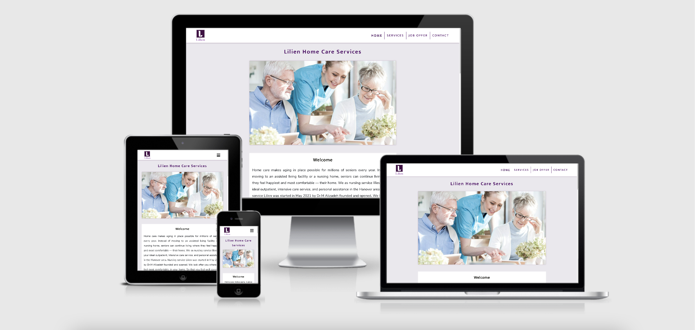
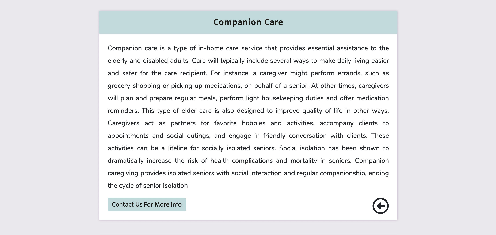
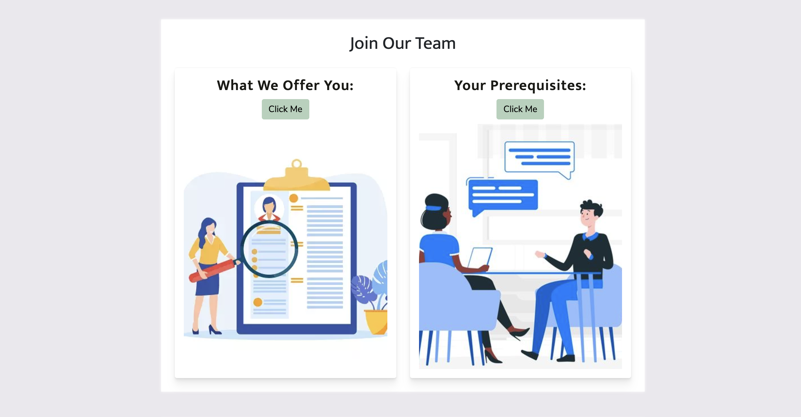
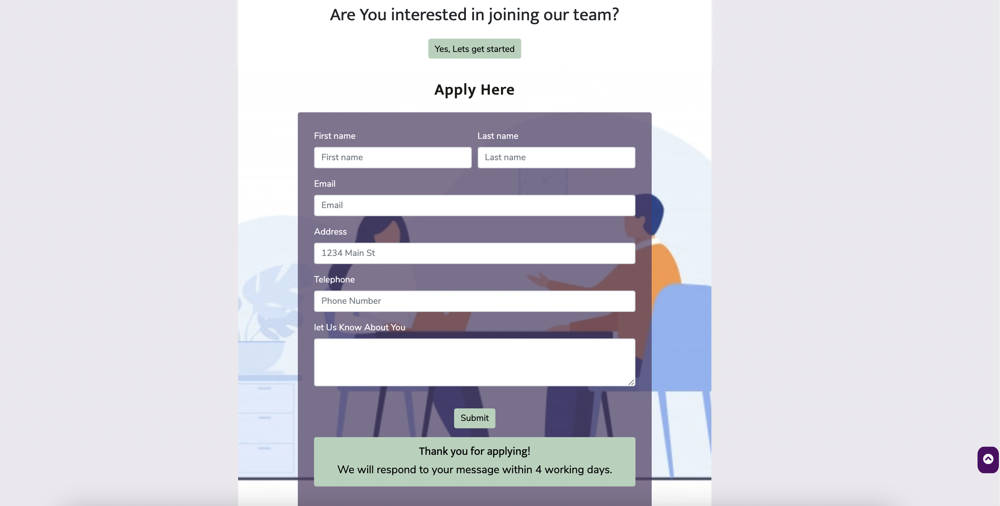

# Maryam Abdolbeigi

## Lilien Home Care Services 
       
[Lilien Home Care Services In Action](https://yasi92.github.io/Home-Care-Services-Lilien/)

This is the website for the Lilien Home Care Services in Hannover. 
The idea to create this website is to improve the existing website in wordpress, however, this version was not inspired by the old version in any way but in terms of content and site material.                   
My goal to create this website is twofold, educational and commercial, and I tried to meet most expectations in both aspects.

## UX
---
This website gives an overview of the Lilien Home Care Services in Hannover. The main information is divided into 4 different pages, which are easily accessible and clearly arranged to make the information intuitive and simple.
The website is quite interactive meaning that it responds to the user's actions.

### The business objectives of this website are:

- Make the brand known and the company virtually accessible.
- Inform users about the company and the services it offers.
- Allow users to contact the company by filling out and submitting form, sending email or phone call.
- Allow users to conveniently find the location and directions.
- Receive emails and forms from potential employees interested in job offers from the company.
- Provide some particularly interesting news and updates related to Covid-19's situation and statics in the country.
- Provide information about the team.

###  The customer objectives of this website are:

- Find out more about this company.
- Learn more about the company's team and services.
- Contact the company to apply for a job.
- Contact the company to request a service.
- Review the terms of service to determine if the patient's needs match the company's services.

### The Ideal customer for this website:

Lives in Hanover and in needs of home care services.

### This project helps users achieve their goals when visiting the website by:

- Providing users with the intended type of information for which they visited the site.
- A good experience of UX.
- Easily navigating between pages and different parts of the site.
- Providing users with simple, understandable and, categorized data.   
- The website is quite intuitive and easy to work with.

### User Stories:

1. As a first time visitor, I want to know more in detail about this particular company.
2. As a first time visitor, I want to know what types of service this company has to offer.
3. As a first time visitor, I want to send them a query by sending an email.
4. As a potential employee, I want to apply for a job and send them my CV.
5. As a first time visitor, I want to know if my needs match the types of the services they offer.
6. As a returning visitor, I want to get directions to the location.

### Wireframe Mockups:                              
                          
Desktop:                  
[Desktop wireframes PDF](Readme-assets/wireframes/Desktop-lilien.pdf)        

iPad:             
[iPad wireframes PDF](Readme-assets/wireframes/ipad-lilien.pdf)               

Mobile:            
[Mobile wireframes PDF](Readme-assets/wireframes/mobile-lilien.pdf)           

1. Desktop

2. Ipad

 

3. Mobile 

## Features-
### Existing Features

* #### Design in Depth
     * The color theme of the website has been inspired by the company name which means Liliy in German. The main and most used color theme is from the purple spectrum with a combination of other cold and relaxing colors.
     

     * The font families used in this project are:
          * 'Nunito Sans' for the body text and other elements.
          * 'Mukta' for the headlines and navigation links.
          * Sans-serif for the fallback font.

*   #### Navigation Bar     
    * Featured on all three pages, the full responsive navigation bar includes links to the Logo, Home page, Services, Job Offer and Contact page and is identical on each page to allow for easy navigation.
    * On the window load, the navigation links slide in to make a smooth animation on every landing view.
    * The animation will be disabled once the menu is collapsed to hamburger icon.
    * This section will allow the user to easily navigate from page to page across all devices without having to revert back to the previous page via the back button.
    * The navigation bar collapses from medium screen sizes to a hamburger icon, which unfolds to a navigation drawer when clicked.
    * Clicking on the logo returns users to the home page as they would expect.

*  #### The landing page area on all pages
    * The landing area, grabs the user's attention by smooth scaling up from top of the window.
    * The headings will smoothly enter into the page after the image has sitted to its final position.

* #### The welcome Text
    * The welcome text is the second section on the home page and provides an overview of the company.

* #### About Our Team
    * "About our team" section provides information about the company's team and management.

    
* #### The section "contact information"    
     * This section provides users with the contact information of the company.
     * The corresponding icons are added to each of the contact paths, not only for design reasons, but also for a better UX experience and quick access.
     * Each of the contact links opens in a new tab to allow easy navigation for the user.
     * The Google map in this section is embedded for users to quickly and easily get directions to the location.
     * To embed the map, the google map API is called.
     * The two columns will be displayed in block levels on Ipad and mobile devices for responsiveness reasons.

* #### Covid-19 News 
    * The section "covid-19 News" appears on the page once it enters to the viewport with an attractive animation.
    * This section uses data from the "coronavirus-smartable" API from RapidAPI and it renders its data on separate cards created with bootstrap.
    * Each card has a "read more button" that navigates the user to the corresponding news resource website in a new tab.
    * The text on the "Show More" button will change to "Show Less" once the column is expanded and vice versa.

* #### Covid-19 Statistics
    * The section "covid-19 Statistics" appears on the page once it enters to the viewport with an attractive animation.
    * This section uses data from the "covid-19 data" API from RapidAPI and it renders its data on a list group created with bootstrap.
    * The text on the "Show More" button will change to "Show Less" once the column is expanded and vice versa.

* #### Services Page
 * The Services page categories different types of services in 4 separate sections.
   * Each row appears to the window with a stagger and smooth animation.
   * Once clicked on the "learn more" link, the layout of the section changes into the long description of each service in a smooth way.
   * From the expanded description, the user can either navigate to the contact page by clicking on the "get in touch" button or go back to the initial layout by clicking on the back button.
   * Each column will be displayed on a block-level on Ipad and mobile devices for responsiveness reasons.

* #### Job Offer Page 
 * On the job offer page, the user can find information about applying for a job.
 * The information regarding requirements and prerequisites are divided into 2 cards.
 * The user can see the text by clicking on the button on each card to flip the cards.
 * The back button, will flip the cards into their front side.
 * Each card appears on a block-level on iPad and mobile view for responsiveness reasons.

 * #### Question Box
   * In this section, the user is asked to choose whether or not they are interested to apply for a job or not.
   * By choosing "Yes let's get started" the application from appears on the page and the user will be asked to fill out the form.
   * By choosing "No thanks" a piece of text appears on the page thanking the user for visiting the website.

* #### Application form 
 * If the user clicks on the "Yes let's get started" button, this application form appears onto the page.
 * The application form allows users to fill out the form and send their message via email.
 * Once the submit button is clicked, an alert appears under the submit button saying that the company will respond to their message in 4 working days. 
 * This is to prevent the user from confusion with hesitating whether the form has been sent.
 * After submitting the form, all the fields will be reset.

* #### Contact Page 
 * The contact information section on the home page is repeated here for more accesibility.
 * The contact form on this section allows users to fill out the form and communicate with the company by sending direct emails.
 * The option to choose the type of services on the form, indicates the intended query the user has.
 * Once the submit button is clicked, an alert appears under the submit button saying that the company will respond to their message in 4 working days. 
 * This is to prevent the user from confusion with hesitating whether the form has been sent.
 * After submitting the form, all the fields will be reset.

 
* #### Sticky back-to-top button
    * After 1000 px of scrolling the page down, a sticky back-to-top button appears at the bottom right of the window to easily navigate to the top page without having to scroll all the way back up.
    * This feature is especially useful on mobile devices, as it prevents the user from having to scroll all the way back to the top of the page.

## Technologies Used

### Languages
- HTML5
- SCSS
- JavaScript

### IDE
- VScode

### Frameworks, Libraries, CDN's, resources:

1. [Bootstrapv4.5.3](https://getbootstrap.com/)       
- This was used for the main layout, forms, alerts and other elements. 

2. [Balsamiq](https://balsamiq.com/wireframes/)         
- This was used to create mockups during the design process.      

3. [GitHub](https://github.com/)         
- Github was used as a remote repository and to deploy the website.      

4. [Git](https://git-scm.com/)         
- Git was used as version control to keep track of files and push them to the remote repository.      

5. [FontAwesome](https://fontawesome.com/start)         
- Font Awesome was used throughout the website to add icons.      

6. [Google Fonts](https://fonts.google.com/)         
- Google fonts were used to import the font styles in the website.      

7. [Chrome Developer Tools:](https://developer.chrome.com/docs/devtools/)        
- This was used for debugging and for checking the responsiveness of the website.      

8. [Ami Responsive](http://ami.responsivedesign.is/)         
- This was used to test the website responsiveness.      

9. [HTMLValidationService](https://validator.w3.org/)     
- This was used to check the markup validity of the web documents.      

10. [CSSValidationService](https://validator.w3.org/)      
- This was used to check the markup validity of the web documents.      

11. [Coolors.co](https://coolors.co/eae8ed-bcdadd-b3d1bb-62a9af-af70c2-500966)     
- This was used to choose the color theme used in the website.      

12. [Unicorn Revealer Extention](https://chrome.google.com/webstore/detail/unicorn-revealer/lmlkphhdlngaicolpmaakfmhplagoaln?hl=en-GB)        
- This is a developer-friendly tool to locate the overflows and was used throughout the process.      

13. [GreenSock](https://greensock.com/gsap/)       
- This Javascript library was used to create animations throughout the website.      

14. [Java Tutor](http://pythontutor.com/java.html#mode=edit)          
- This was used to debugg the javascript codes.      

15. [w3schools](https://www.w3schools/)         
- This was used for documentation for most troubles and errors.      

16. [jQuery](https://jquery.com/)      
- This was used as Javascript library to write less Javascript codes.      

17. [RapidAPI](https://rapidapi.com/collection/list-of-free-apis)       
- This was used for calling APIs.      

18. [EmailJS](https://www.emailjs.com/)        
- This was used to send direcct emails from the website.      

19. [Google maps API](https://console.cloud.google.com/google/maps-apis/)           
- Google map API was used to embed the google map into the website.      

20. [Pexels](https://www.pexels.com/nl-nl/)            
- This was used to download images for the website.      

21. [Pinterest](https://nl.pinterest.com/)        
- This was used to download images for the website.      

22. [favicon.io](https://favicon.io/)       
- This was used to create and insert a favicon.      

## Testing
Testing information can be found in a separate [TESTING.md file](TESTING.md)
## Deployment

### Github
1. Log into Github and locate the relevant repository.
2. Click on the settings buttons on the menu.
3. Scroll down to the "Github pages".
4. Click on the link "Check it out here".
5. Change the branch from "none" to "main/master".
6. Click on the "save" button.
7. It might take a couple of minutes to retrieve the link to the published website in a green box.
8. Add the link of the website to the "About" section of the repository and include a short description of the project.
9. Click "Save Changes" and the link will be available in the About section of the repository.

### Forking the GitHub Repository
1. Sign in to GitHub and locate the GitHub Repository.
2. Go to the top right side of the screen and below the navigation bar is the "Fork" button.
3. After clicking this, you will now have a copy of the original Repository in your GitHub account.

### Local Clone
This is used to make changes to the project code.

1. log in to Github and locate the intended repository.
2. Above the Repository files, click on the "Code" button.
3. You then see three options, HTTPS, SSH and GitHub CLI. Select one and copy the URL.
4. Open a new terminal on Git Bash.
5. Now change the current working directory to the location you'd like the cloned directory to be made.
6. Type git clone, and then paste the URL you copied from the remote repository.

`$ git clone https://github.com/Yasi92/Home-Care-Services-Lilien.git`

### Author 

## Credits

- [Stackoverflow](https://stackoverflow.com/)
- [w3schools](https://www.w3schools/howto/tryit.asp?filename=tryhow_js_scroll_to_top)
- [GreenSock](https://greensock.com/gsap/)

## Content
                   
- The content of services description has been taken from this link, only for educational purposes.      
 [Visiting Angels](https://www.visitingangels.com/)         
- The content of welcome text, team information, job description and contact info has been taken from the current website of Lilien Home Care Website.     
 [pflegedienst-lilien](https://pflegedienst-lilien.de/)           
- The content of corona news has been taken from this API.          
[Coronavirus Smartable](https://rapidapi.com/SmartableAI/api/coronavirus-smartable/)         
- The covid-19 statistics' data In Germany has been taken from this API.              
 [COVID-19 data](https://rapidapi.com/Gramzivi/api/covid-19-data/)             
- The embeded map on the website is created by Google Map APIs.             
 [Google Map API](https://console.cloud.google.com/google/maps-apis/)             

## Media
 The photots throughout the website were taken from:
- [Pexels](https://www.pexels.com/)  
- [Pinterest](https://nl.pinterest.com/)
- [pflegedienst-lilien](https://pflegedienst-lilien.de/)

## Acknowledgements

- Tutors at Code Institute for their continued support.
- Code Institute's Slack community was a great help every step of the way during the project.
- Stack Overflow.
- My mentor Gurjot Singh.
- Code Institute's Slack community was a great help every step of the way during the project.

