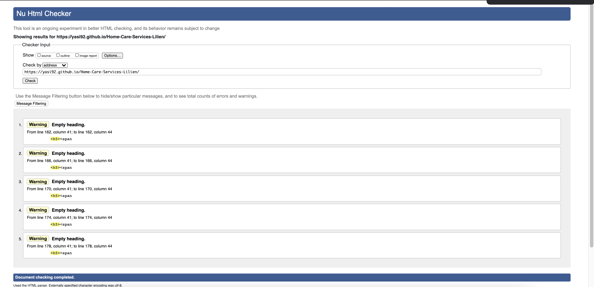
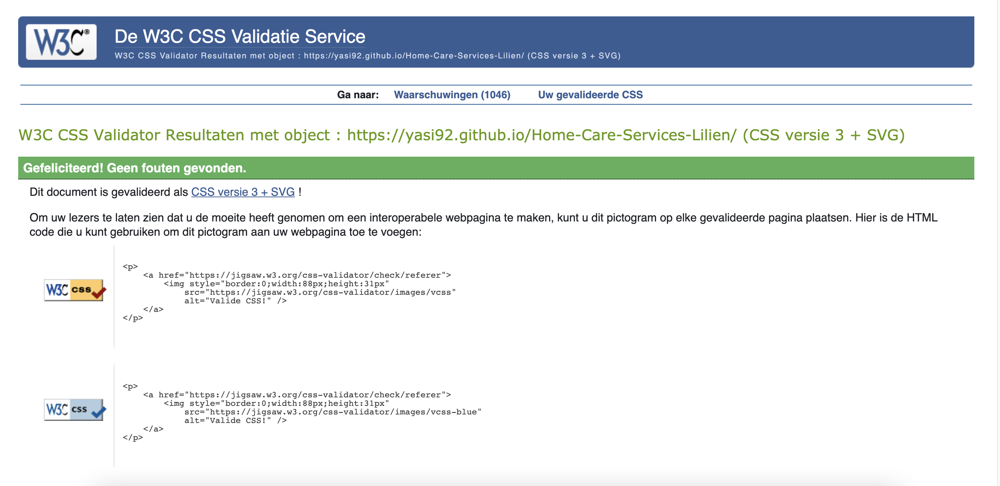

# Buno Coffee Website - Testing in detils

[Lilien Home Care Services In Action](https://yasi92.github.io/Home-Care-Services-Lilien/)          
[Main README.md file](/README.md)

## Validation

-     was used to validate the code in the three HTML files. I tested each page separately, debugged the errors and, in the end, they have all passed with no errors.

-  was used to validate the code in my style.css file.
- The website has been tested with the Lighthouse for each page separately and on both desktop and mobile devices and, required actions have been taken to improve the functionality of the website as much as possible and as far as related to HTML and CSS.
  Was used to check the overall performance of the website and as a way to improve the website performance.
                                  

| Bugs | Solutions |            
| ----------- | ----------- |
| When testing the published website, noticed that the "scroll-back-to-top" button does not appear after scrolling down the page and its position behaves as if it had an absolute position. The button was not showing on the viewport but it was placed at the bottom of the page instead. | I have fixed this by removing the perspective property from the body element.|
| When testing the HTML files in the w3 validator, I received errors saying that buttons must not appear as a descendant of 'a' elements or vice versa.| I have fixed this by removing the nested structure and instead of giving a button class from bootstrap to an 'a' element.|
| When Viewing the job.html on iPhone devices, noticed that the cards would not flip on click but this was not an issue on other devices. | I have fixed this by adding -webkit-... -o-... and -moz-... to the relevant properties for more compatibility.|

## Unfixed Bugs

|When testing the HTML files in the w3 validator, I received warnings regarding empty headings. | I have left this unfixed since the data filling out these empty headings comes from an API using Javascript.|

## Known issues
- In the job offer page "job.html", there was an issue with flipping cards on mobile view. to fix this issue, I would have to add perspective to the body element and that would have caused another issue with the back-to-top button as it would disable the fixed position of the button and instead of the viewport, it would place the button all the way down the page.
To fix this, I gave a class to the body element of that page and set the perspective property using a media query, but this left the back-to-top (sometimes) disabled on the job offer page on a mobile view which does not cause a serious issue as the page content is not long.

## Client stories testing:

The potential common paths through the website:

- Home > Services > Contact
- Home > Contact
- Home > Job Offer 
              

Each of these possible paths is achievable by simply navigating through the navigation bar and a menu link shortcut on the "Home" page.
### Testing client stories from UX section of [README.md](/README.md)

1. As a new visitor, I would like to get some general information and an introduction to the business.

      - No matter what page the user lands on, they can navigate to the "Home" page and achieve their goal.

2. As a new visitor, I would like to 
      

     

## Manual (logical) testing of all elements and functionality on every page.      

###  Navigation Bar

 - Go to the "Home" page from a desktop.
 - Change the screen size from desktop to tablet to verify that the navigation bar is responsive and switches from the inline menu to the burger icon dropdown menu at the appropriate place.
 - Open the page by Chrome developer tool and check the responsiveness of the navigation bar and make sure that the expanded navigation bar switches to a burger icon dropdown menu at the appropriate place.
 - Click on the burger icon and make sure the menu items dropdown.
 - Click on every link item to verify they function accordingly.
 - Click on the logo in the navigation bar and verify that it links to the "Home" page.
 - Hover over every item and verify that the text grows when hovering and returns to the normal size when removing the hover.
 - Make sure the logo font size adjust appropriately as specified in the media query.
 - Click on every navigation link and make sure the border-bottom appears under the correct item.

###  The landing page image and text   

 - Go to the "Home" page from a desktop.
 - Make sure the image and the text place in the correct position.
 - Click the refresh button on the browser and confirm the animation effects on the image and the text run smoothly and as expected.
 - Reduce the width of the window to confirm that the image and the text lay on block levels.
      

###  The section "" 

 - Go to the "Home" page from a desktop.
 - Make sure the image and the text place in the correct position.
 - Click the refresh button on the browser and confirm the animation effects on the image and the text run smoothly and as expected.
 - Reduce the width of the window to confirm that the image and the text lay on block levels.
 - Click on the "Menu" link and make sure it links to the "Menu" page.

###  The section ""
 - Go to the "Home" page from a desktop.
 - Make sure the image and the text place in the correct position.
 - Reduce the width of the window to confirm that the image and the text lay on block levels.
 - Ensure that the images inside the carousel box slide to the next one automatically.
 - Click on the next and previous icons in the carousel box to check if they respond.

###  The section "" 
 - Go to the "Home" page from a desktop.
 - Make sure the image and the text place in the correct position.
 - Reduce the width of the window to confirm that the image and the text lay on block levels.
 - Ensure that the images inside the carousel box slide to the next one automatically.
 - Click on the next and previous icons in the carousel box to check if they respond.

###  The section ""
 - Go to the "Home" page from a desktop.
 - Scroll down the page to the section.
 - Reduce the width of the window to confirm that the paddings and spacings switch to tablet and mobile mode accordingly.

###  The section ""   
 - Go to the "Home" page from a desktop.
 - Scroll down the page to the section.
 - Reduce the width of the window to confirm that the map and the text lay on block levels.
 - Click on the map to confirm it navigates to the Google map and directs to the correct address.
 - Click on the telephone icon to confirm the link function accordingly.
 - Click on the Instagram link to verify that it opens the Instagram page in a new tab.
 - Click on the Mail icon to verify that it leads to the mailbox with the correct email address and, in a new tab.
     

###  Services page 
 - Navigate to the "Menu" page from a desktop.
 - Make sure the spacing around the rows, tables, and items is applied correspondingly.
     - When viewing the "Menu" page on a mobile device, noticed that the padding of the rows do not match the padding of the rows on the "Home" page. This has been fixed by adjusting the x-axis padding.
 - Reduce the width of the window to confirm that each table lays on a block level.

###  Job Offer page
 - Navigate to the "Job Offer" page from a desktop.
 - Make sure the spacing around the rows and images is applied correspondingly.
 - Hover over every single image and check that the opacity of images changes and revert back when removing the hover.
 - click on every single image and make sure the right image opens in the modal.
 - Click on an image and wait to confirm that all the images slide through the carousel box in order.
 - Ensure the next and previous icons in the carousel box function accordingly.
 - Check the functionality of the close button on the top right of the images in the modal.
 - Reduce the width of the window to confirm that all the images behave responsively.
 - Open the page in the "Developer Tool", choose a mobile device and ensure that the images lay on a block level.

###  Sticky back-to-top button
 - Verify that the button shows up in the right position on every page.
 - Click on the button to confirm that the button works.
 - Open the page in the "Developer Tool", choose a mobile device and ensure that the size and spacing of the button change properly-

### Footer
 - Confirm that footer code is identical on all HTML pages.

## Further Testing
 - I have tested the website on the following internet browsers and no serious issue was found:

     - Google Chrome
     - Safari
     - Firefox

- I have tested the website on the following devices:

     - iPhone X/12/12 pro (On physical devices)
     - Galaxy S21 (On physical device)
     - iPad (On physical devices)
     - iPad Pro (Chrome Developer Tools)
     - iPad mini (Chrome Developer Tools)
     - Galaxy Note 3 (Chrome Developer Tools)
     - Galaxy S III (Chrome Developer Tools)
     - Laptops
 

- Links were tested repeatedly.
- Friends and family members were asked to review the website, its content and the user experience overall.
- Code Institute students were asked to review the website.